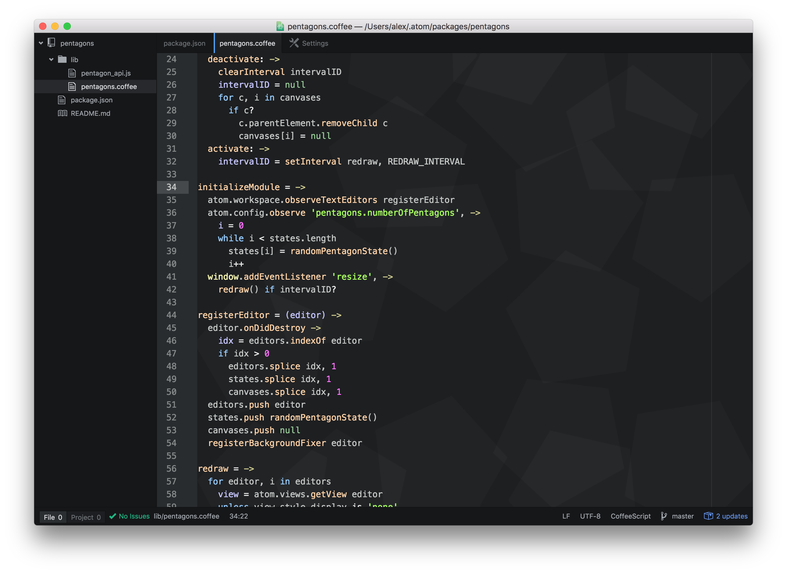

# pentagons

This brings [pentagons](https://github.com/unixpickle/pentagons) to the Atom text editor. Pentagons already make for a great background for almost every website. Now they can also improve your programming experience!

# Screenshot

It's hard to describe this plugin in words. Here's a picture, instead:

